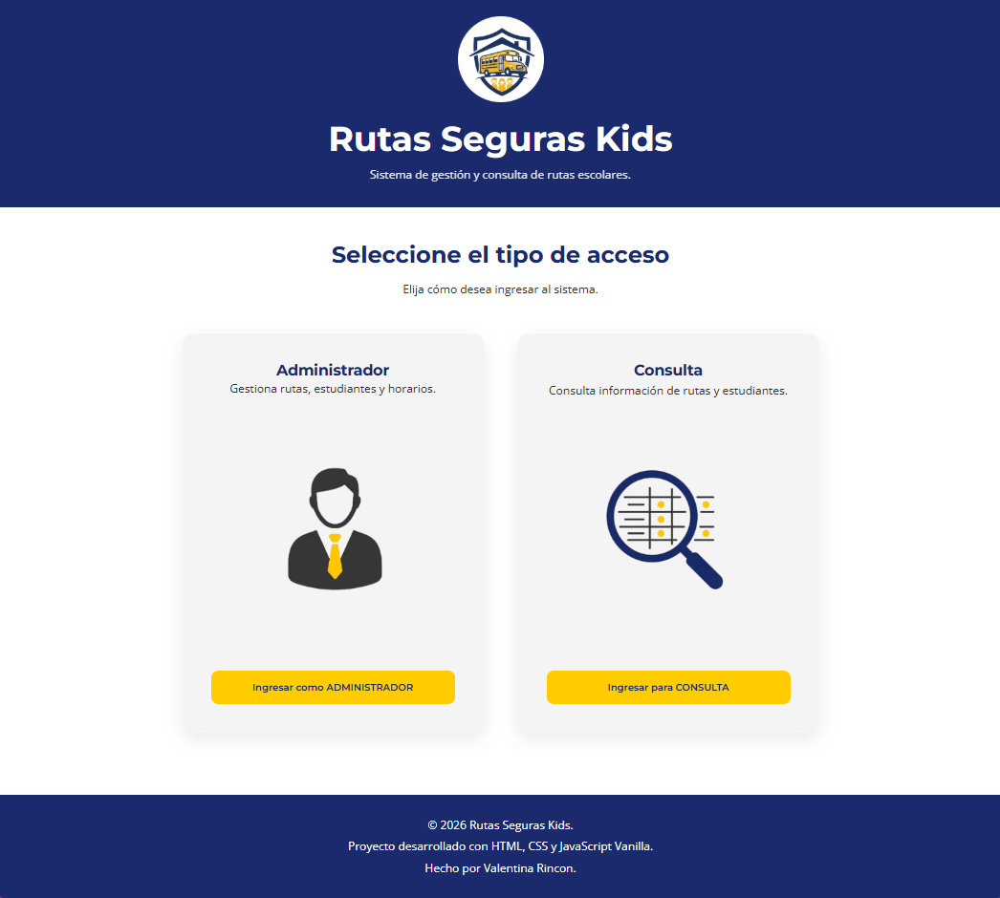
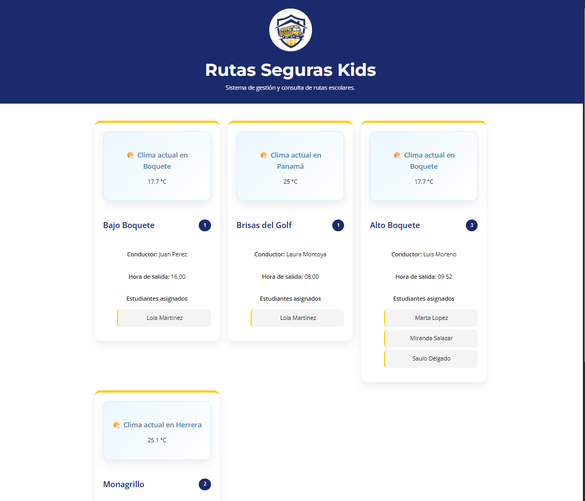
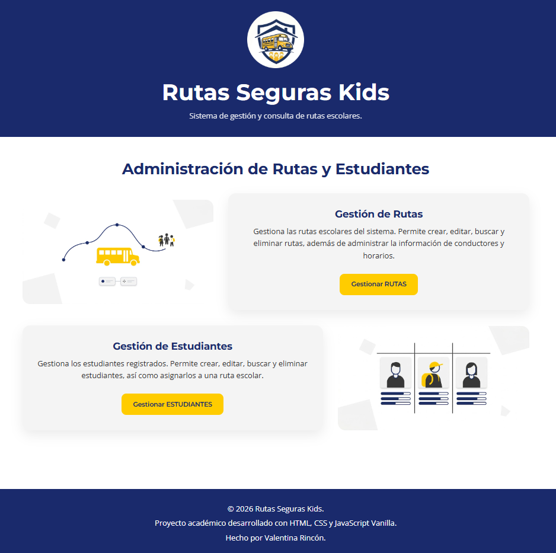
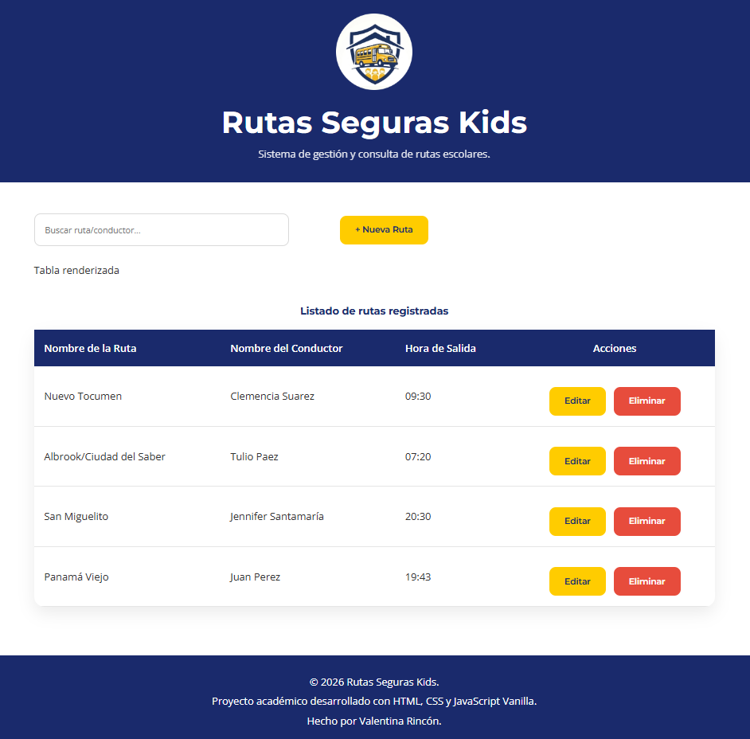
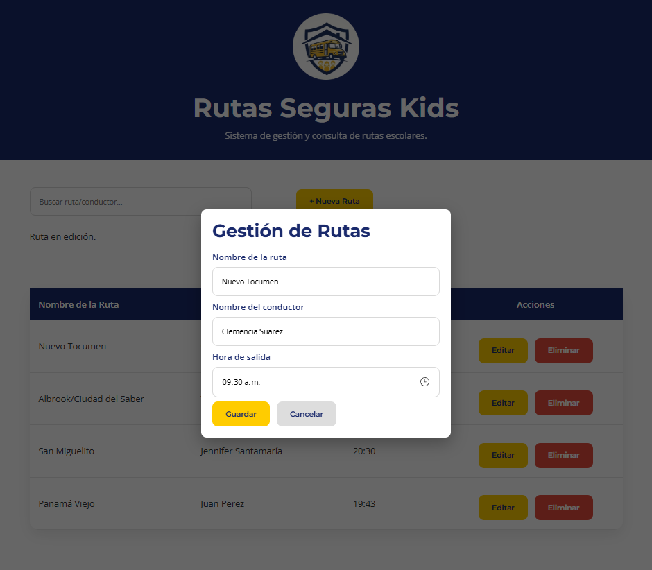

# 🚍 Rutas Seguras Kids

Sistema web desarrollado con HTML, CSS y JavaScript Vanilla para la gestión y consulta de rutas escolares.

##  Descripción del proyecto

Rutas Seguras Kids es una aplicación web que permite administrar rutas escolares y estudiantes asignados a cada ruta.

El sistema cuenta con tres módulos principales:

### Gestión de rutas

* Crear rutas escolares.
* Editar rutas existentes.
* Eliminar rutas.
* Buscar rutas mediante filtros.
* Almacenamiento persistente utilizando LocalStorage.

### Gestión de estudiantes

* Registrar estudiantes.
* Asignar estudiantes a una ruta.
* Editar información de estudiantes.
* Eliminar estudiantes.
* Buscar estudiantes mediante filtros.
* Relacionar estudiantes con rutas mediante identificadores.

### Consulta de rutas

* Visualización de rutas mediante Web Components.
* Listado automático de estudiantes asignados a cada ruta.
* Consulta del clima actual de Ciudad de Panamá mediante una API pública (Open-Meteo).
* Diseño responsive para dispositivos móviles, tabletas y computadoras.

##  Tecnologías utilizadas

* HTML5
* CSS3
* JavaScript Vanilla (ES6+)
* LocalStorage
* Web Components
* Fetch API
* Async/Await
* Open-Meteo API

## Instrucciones de ejecución

1. Descargar o clonar el repositorio.
2. Abrir la carpeta  del proyecto.
3. Ir a archivo "Index.html" y ejecutarlo en el navegador
4. Para explorar como Administrador, ingresar el código "admin123"
5. Para explorar como Consulta, ingresar el código "consul123"

##  Funcionalidades implementadas

* CRUD completo de rutas.
* CRUD completo de estudiantes.
* Persistencia de datos mediante LocalStorage.
* Eventos personalizados para registro de acciones.
* Búsqueda dinámica mediante filtros.
* Componentes personalizados utilizando Web Components.
* Consumo de API pública utilizando Fetch y Async/Await.
* Diseño responsive mediante Media Queries.

## Vistas principales

#### Página Principal

#### Sección de Consultas 

#### Sección de Administrador

#### CRUD Rutas

#### Ventana emergente

##  Desarrolladora

Valentina Rincon

Proyecto desarrollado como práctica de JavaScript Vanilla.
